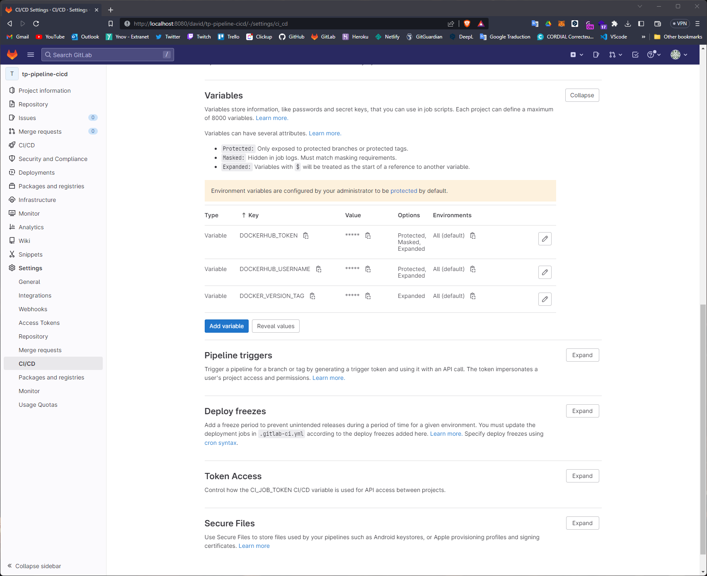

# Docker Compose Gitlab and Gitlab Runner
```yaml
version: '3.7'

networks:
  gitlab-net:
    name: gitlab-network

services:
  gitlab:
    image: 'gitlab/gitlab-ce:latest'
    restart: always
    hostname: 'gitlab'
    container_name: gitlab-ce
    environment:
      GITLAB_OMNIBUS_CONFIG: |
        external_url 'http://gitlab'
    ports:
      - '8080:80'
      - '8443:443'
    volumes:
      - './gitlab/config:/etc/gitlab'
      - './gitlab/logs:/var/log/gitlab'
      - './gitlab/data:/var/opt/gitlab'
    networks:
      - gitlab-net
  
  gitlab-runner-docker:
    image: gitlab/gitlab-runner:alpine
    container_name: gitlab-runner-docker
    restart: always
    depends_on:
      gitlab:
        condition: service_healthy
    volumes:
      - /var/run/docker.sock:/var/run/docker.sock
      - './gitlab/gitlab-runner:/etc/gitlab-runner'
    networks:
      - gitlab-net

  gitlab-runner-shell:
    image: gitlab/gitlab-runner:alpine
    container_name: gitlab-runner-shell
    restart: always
    depends_on:
      gitlab:
        condition: service_healthy
    volumes:
      - /var/run/docker.sock:/var/run/docker.sock
      - './gitlab/gitlab-runner:/etc/gitlab-runner'
    networks:
      - gitlab-net
```

# Gitlab Runner

### Register Runners with executor shell
```shell
gitlab-runner register \
  --non-interactive \
  --url "http://gitlab/" \
  --registration-token "GR1348941PibTM4z4yxYyo4e2y9Xs" \
  --executor "shell" \
  --description "shell-runner" \
  --tag-list "runner-2,shell"
```

### Register Runners with executor docker
```shell
gitlab-runner register \
  --non-interactive \
  --url "http://gitlab/" \
  --registration-token "GR1348941PibTM4z4yxYyo4e2y9Xs" \
  --description "docker-runner" \
  --tag-list "runner-3,docker-2" \
  --executor "docker" \
  --docker-image alpine:latest \
  --docker-privileged \
  --docker-network-mode gitlab-network
```

### Sreenshots


# Gitlab CI/CD

### .gitlab-ci.yml
```yaml
image: docker

services:
  - docker:dind

variables:
  DOCKER_TLS_CERTDIR: ""

before_script:
  - docker info

stages:         
  - build

build-job:      
  stage: build
  tags:
    - docker
  before_script:
    - echo "Login dockerhub"
    - docker login -u $DOCKERHUB_USERNAME -p $DOCKERHUB_TOKEN
  script:
    - echo "Build image"
    - docker build -t $DOCKERHUB_USERNAME/udagram-api-feed:$DOCKER_VERSION_TAG ./udagram-api-feed/
    - docker build -t $DOCKERHUB_USERNAME/udagram-api-user:$DOCKER_VERSION_TAG ./udagram-api-user/
    - docker build -t $DOCKERHUB_USERNAME/udagram-frontend:$DOCKER_VERSION_TAG ./udagram-frontend/
    - docker build -t $DOCKERHUB_USERNAME/udagram-reverseproxy:$DOCKER_VERSION_TAG ./udagram-reverseproxy/
    - echo "Deploy image"
    - docker push $DOCKERHUB_USERNAME/udagram-api-feed:$DOCKER_VERSION_TAG
    - docker push $DOCKERHUB_USERNAME/udagram-api-user:$DOCKER_VERSION_TAG
    - docker push $DOCKERHUB_USERNAME/udagram-frontend:$DOCKER_VERSION_TAG
    - docker push $DOCKERHUB_USERNAME/udagram-reverseproxy:$DOCKER_VERSION_TAG
  only:
    - main
```

### Sreenshots




# Docker Hub

### Sreenshots


